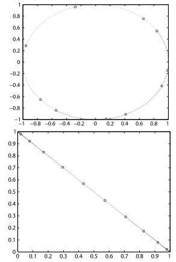

# Patterns in data

## Data

这本书处理数据和通过从识别有价值的知识来利用这些数据的方法。我们所说的数据是指任何观测、测量或记录仪器的输出。因此这个包括电子图片，描述物理系统状态的向量，DNA序列，文本块，时间序列，商业交易记录等等。我们所说的知识指的是一些更抽象的东西，在数据之间的关系和数据内部的模式层面上。这些知识可以让我们从数据的来源中做出预测或者对数据内在关系做出推断。

## Patterns

设想一个数据集，其中包含太阳系中数千个行星位置的观测数据，例如九个行星中每一个每日位置记录。很明显，一颗行星在某一天的位置并不独立于同一颗行星在前几天的位置，在这些位置的基础上可以很精确地预测出行星的位置。数据集中还存在一些可以从数据的其他部分重建的冗余的信息，因此这并不是严格要求的。在这种情况下，数据集被认为是冗余的，可以从数据中提取简单的规则，并使用它来重建每颗行星在每一天的位置。决定行星位置的定律即为开普勒定律。开普勒的发现可以被看作是模式识别或数据驱动的分析的一个早期的例子。

通常我们预测一个特征作为剩余特征的函数：例如距离作为周期的函数。为了能够做到这一点，关系必须是可逆的，以便所需的特征可以表示为其他值的函数。其他更一般的关系也可能出现在数据中，可以被检测到和利用。例如，如果我们找到表示为满足以下条件的不变函数$f$的一般关系：
$$
f(\mathrm{x}) = 0
$$
其中$\mathrm{x}$为数据项，我们可以使用它来识别不符合关系的奇异的或失败的数据项，即$f(x)\neq 0$。然而，在这种情况下，很难实现压缩的潜力，因为这需要我们在上式的流形上建立一个低维的坐标系。

图1.1的上面的那幅图在$(x,y)$坐标轴中展示了数据。我们可以对这些位置背后的规则做一些假设。但是如果我们考虑公式$c_1x^2 + c_2y^2 + c_3xy + c_4x+c_5y+c_6$，我们发现对于某些参数的选择是常数。在图1.1下面的那幅图中我们找到了两个特征的线性关系，$x^2$和$y^2$。事实上，数据中的这种不变性意味着这颗行星沿着椭圆轨道运行。通过改变坐标系，这种关系变成了线性关系。

> 图1.1

在上面的例子中我们看到了如何通过改变坐标系来改变模式。使用初始的坐标系模式被表达为二次式形式，而使用另一个坐标系则变为线性函数。通过改变描述数据的坐标系来转换模式表示的可能性将是本书反复出现的主题。

例子中的模式有满足下列形式的函数$f$：
$$
f(\mathrm{x}) = 0
$$
对于所有的数据点$\mathrm{x}$。我们也可以以这种形式表达开普勒第三定律所描述的模式：
$$
f(D,P) = D^2 - P^3 = 0
$$
或者：
$$
g(D,P) = 2\log D-3\log P=0
$$
相似地，如果我们有一个函数$g$，对于每一个数据点$(x,y)$预测一些输出值$y$作为输入特征$x$的函数，我们可以将此模式描述为：
$$
f(x,y) = \mathcal{L}(g(x),y)=0
$$
其中$\mathcal{L}:Y\times Y\rightarrow \mathbb{R}^+$为损失函数，用来衡量两个输入之间的差距。

***

定义1.3：数据源的一般精确模式(`exact patterns`)是满足以下条件的非平凡函数$f$：
$$
f(\mathrm{x}) = 0
$$
对于可以从数据源生成的所有数据$\mathrm{x}$。

这个定义只覆盖精确的模式(exact patterns)。我们首先考虑需要覆盖近似模式(approximate patterns)的需要的松弛(relaxation)。以预测作为数据项$(x,y)$的输入特征$x$的函数值$y$的函数$g$为例，如果我们不能期望去得到$g(x)$和$y$精确得相等，我们使用损失函数$\mathcal{L}$来衡量不匹配的数量。这个可以通过当两个参数相似但不一定相同时允许函数输出$0$来实现，或者通过允许函数$f$输出小但非零的正数。我们将采用第二种方法，因为当与概率模式结合时，它给出了一个清晰而有用的概率匹配概念。

***

定义1.4：数据源的一般近似模式(`approximate patterns`)是满足以下条件的非平凡函数$f$：
$$
f(\mathrm{x})\approx 0
$$
对于任何从数据源产生的数据$\mathrm{x}$。

最后，我们考虑统计模式。在这种情况下有一个概率分布生成数据。在许多情况下可以假设独立且同分布地生成各个数据项，一种通常被称为独立同分布或简写为`iid`的情况。我们将使用符号$\mathbb{E}$表示某个变量在某个分布下的期望。

注意，在精确和近似模式的情况下，我们对模式的定义适用于每个单独的数据项，但是对于统计模式的情况，我们将根据潜在的分布来考虑函数的期望。在这种情况下我们要求模式函数为正的来保证一个小的期望值是从小的函数值中产生的而不是从大的正数和负数的平均值中产生的。

***

定义1.5  从分布$\mathcal{D}$中独立同分布产生的数据源的一般统计模式是一个非平凡非负函数$f$，满足：
$$
\mathbb{E}_{\mathcal{D}}f(\mathrm{x})=\mathbb{E}_{\mathrm{x}}f(\mathrm{x})\approx 0
$$
如果分布不满足独立同分布要求，这通常是由按顺序生成的数据项之间的依赖关系或潜在分布慢慢变化导致的。第一种情况的一个典型的例子就是时间序列数据。在这种情况下，我们通常可以假设产生数据的源是遍历的，也就是，随着时间的推移依赖性会递减到`idd`的概率。

***

定义1.7(模式分析算法)：模式分析算法将来自要分析的数据源的有限示例集合作为输入。它的输出要么是在数据中没有检测到任何模式的指示，要么是算法断言的正的模式函数$f$，满足：
$$
\mathbb{E}f(x)\approx 0
$$
其中期望是源生成的数据。我们将输入示例称为训练实例或训练数据，并将模式函数$f$称为算法返回的假设。期望值被称为泛化误差。

